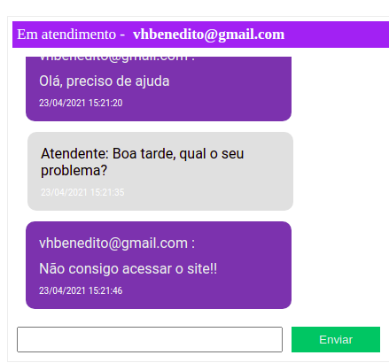

# # Boas vindas ao repositório do projeto chat-web-socket
Chat desenvolvido com WebSocket na NLW5 na trilha de NodeJs

### Objetivos do projeto:

O objetivo deste projeto é prover uma API de comunicação bidirecional entre cliente e servidor através de um chat de atendimento.

### O que foi aplicado neste projeto:

- Neste projeto pude aprimorar conteúdos de NodeJs, Express e Banco de dados já aprendidos;
- Estruturar Banco de dados SqLite e utilizar a ferramenta 'Beekeeper-Studio'; 
- Utilizar 'Migrations' para versionar o banco de dados da aplicação, gerando assim uma forma mais prática e confiável de manipular a base de dados;
- Utilizar o TypeORM, um módulo avançado de gerenciamento de relações de objeto que é executado no Node.js;
- Conhecer da linguagem TypeScript;
- Utilizar WebSocket como protocolo de comunicação bidirecional cliente-servidor;

## Chat Atendente

## Chat Cliente

---

